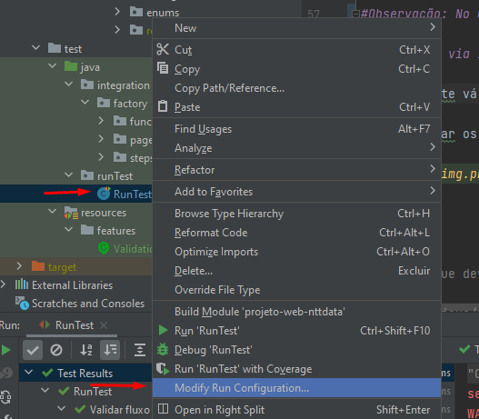
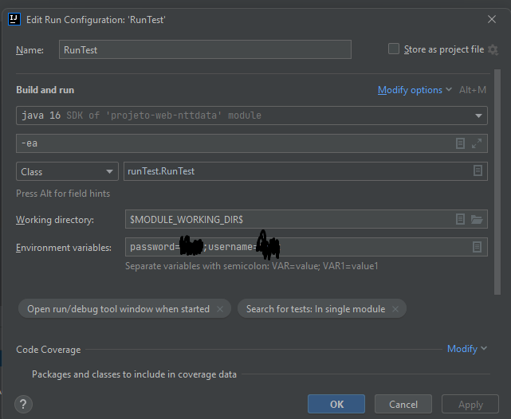
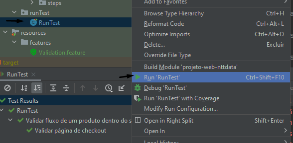

<h1 align="center">Automação Projeto Ntt Data Web</h1>

</h1>
<p align="center">🚀 Projeto de automação de testes utilizando as técnicas da metodologia BDD.</p>


## Começando

Para executar o projeto, será necessário instalar os seguintes programas:

- [JDK 13: Necessário para executar o projeto Java](https://www.oracle.com/java/technologies/javase/jdk13-archive-downloads.html)
- [Maven 3.6.3: Necessário para realizar o build do projeto Java](https://downloads.apache.org/maven/maven-3/3.6.3/binaries/apache-maven-3.6.3-bin.zip)

*Não Esqueça de configurar as variáveis de ambiente para execução.
- [Tutorial para configuração das variáveis](https://medium.com/beelabacademy/configurando-vari%C3%A1veis-de-ambiente-java-home-e-maven-home-no-windows-e-unix-d9461f783c26#:~:text=Bom%2C%20mas%20o%20que%20s%C3%A3o,arquivos%20necess%C3%A1rios%2C%20inclusive%20os%20bin%C3%A1rios.)
- [IntelliJ: Para desenvolvimento do projeto](https://www.jetbrains.com/pt-br/idea/)

*Instale o MySQL Workbench na sua maquina para execução do Banco de Dados
- [Download MySQL Workbench](https://www.mysql.com/products/workbench/)
 
*Ou caso prefira pode utilizar uma imagem docker para execução do banco
- [Download MySQL Docker Image](https://docs.docker.com/desktop/windows/install/)
- [Como instalar o MySQL pela imagem do Docker](https://br.joaoneto.blog/suba-um-conteiner-mysql-no-docker/)

Após configurar o banco execute os seguintes scripts : 

CREATE DATABASE `banco_teste_automacao`;

CREATE TABLE `massas` (
`IDMASSAS` int(11) NOT NULL AUTO_INCREMENT,
`NAME_PRODUCT` varchar(45) DEFAULT NULL,
`CUSTOMIZATION` varchar(45) DEFAULT NULL,
`DISPLAY` varchar(600) DEFAULT NULL,
`DISPLAY_RESOLUTION` varchar(45) CHARACTER SET utf8 COLLATE utf8_general_ci DEFAULT NULL,
`DISPLAY_SIZE` varchar(45) DEFAULT NULL,
`MEMORY` varchar(45) DEFAULT NULL,
`OPERATING_SYSTEM` varchar(45) DEFAULT NULL,
`PROCESSOR` varchar(255) DEFAULT NULL,
`TOUCHSCREEN` varchar(45) DEFAULT NULL,
`WEIGHT` varchar(45) DEFAULT NULL,
`COLOR` varchar(45) DEFAULT NULL,
PRIMARY KEY (`IDMASSAS`)
) ENGINE=InnoDB AUTO_INCREMENT=2 DEFAULT CHARSET=utf8mb4 COLLATE=utf8mb4_0900_ai_ci;
insert into
massas(NAME_PRODUCT,CUSTOMIZATION,DISPLAY,DISPLAY_RESOLUTION,DISPLAY_SIZE,MEMORY,OPERATING_SYSTEM,PROCESSOR,TOUCHSCREEN,WEIGHT,COLOR)
values("HP PAVILION 15Z TOUCH LAPTOP","Simplicity","15.6-inch diagonal Full HD WLED-backlit Display(1920x1080) Touchscreen","1920x1080","15.6","16GB DDR3 - 2 DIMM","Windows 10","AMD Quad-Core A10-8700P Processor + AMD Radeon(TM) R6 Graphics","Yes","5.51 lb","GRAY");

#Observação: No ultimo script cuidado com espaços ou quebra de linhas pois pode quebrar todo o teste.

## Execução via IDE

Primeiramente vá até esse arquivo e selecione esta opção , (caso esteja utilizando Eclipse basta colocar Run as e colocar na pasta enviroments)



Depois basta colocar as variaveis de usuario e senha do banco configurado:



Depois para executar os testes basta executar o runner conforme abaixo :




## StatusReport
####  Após rodar os cenário , execute o comando abaixo dentro da pasta target para gerar o AllureReports
```bash
allure serve allure-results
```
